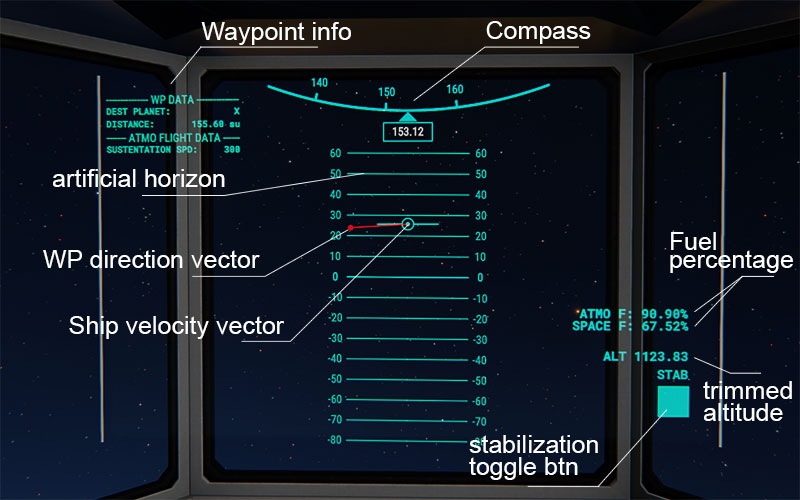
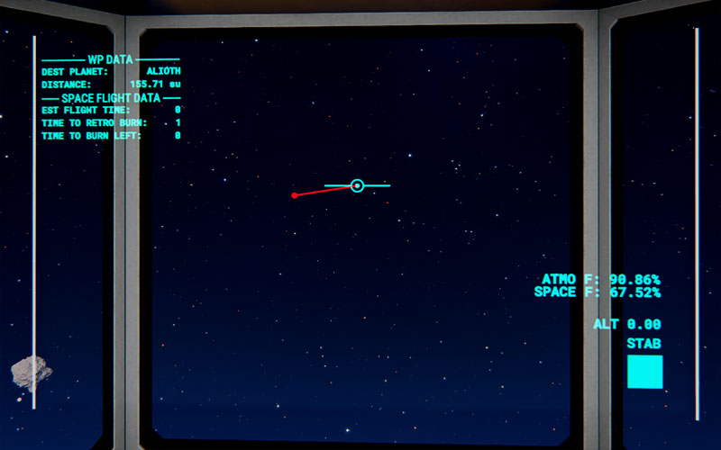

# DS HUD

**Atmosphere flight:**

**Space flight:**

## Description
Just another one HUD.
I make it in my own purpose whatever it means is just mine business.

The main difference is that it integrated into a transparent screen (if you wish, sure you can use it on a basic screen :)) bc I like to pilot my ships from the cockpit. Thus it helps me to fly and I always test my product.

## Installation
You need to place screen and gyro in your ship. No need to link them.

Simply copy **ds_hud_autoconf.conf** to your game folder under **Dual Universe\data\lua\autoconf\custom**  
then RMB on your **control unit -> Advanced -> Run custom autoconfigure -> DS_HUD**

To use waypoint feature (if it supports) paste desired waypoint into the LUA chat

### Contacts
You can find me in Dual Universe. My character's name is DarthShelL